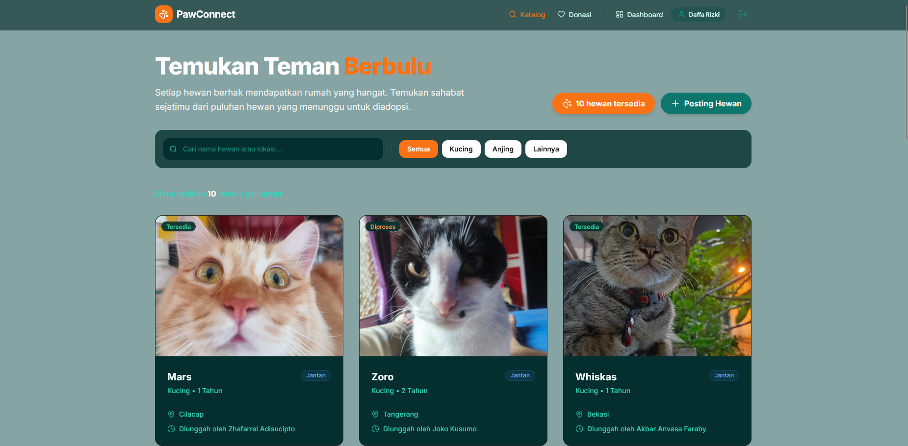

# PawConnect 🐾

PawConnect adalah platform digital untuk mempermudah proses adopsi hewan peliharaan dan donasi ke shelter atau kampanye hewan. Proyek ini merupakan Proyek Akhir untuk mata kuliah Praktikum Sistem Basis Data (SBD).

## 👥 Anggota Kelompok 7
- **Akbar** - Backend Core & Database Architect
- **Daffa** - Backend Auth System & Redis Optimization
- **Nabil** - Dashboard & Catalog Development
- **Zhafarrel** - Frontend Lead & UI Components

## 🛠️ Teknologi yang Digunakan

### Frontend
- **Next.js** (App Router)
- **Tailwind CSS v4**
- **TypeScript**

### Backend
- **Express.js** API
- **Multer** (File Upload)
- **Cloudinary** (Image CDN)

### Database & Cache
- **PostgreSQL** (NeonDB)
- **Redis** (Session & Caching)

## 📂 Struktur Direktori

- `/frontend` - Source code interface menggunakan Next.js.
- `/backend` - Source code backend API dengan Express.js dengan mengadopsi arsitektur 4 layer: Routes → Controllers → Services → Models.
- `/database` - File skema database (DDL), *seed* data (DML), dan berkas migrasi SQL.
- `/docs` - Dokumentasi pelengkap proyek (Skenario, ERD, UML, Flowchart).
- `/presentation` - File presentasi untuk laporan akhir.

## 📸 Tampilan Aplikasi

## 💡 Fitur Utama

- **Adopsi Hewan**: Eksplorasi katalog hewan, filter (spesies, lokasi), dan pengajuan adopsi secara terstruktur.
- **Posting Hewan**: Formulir penambahan profil hewan (dukungan *upload* foto/video menggunakan Cloudinary).
- **Sistem Donasi**: Katalog *campaign* penggalangan dana terverifikasi, donasi berjalan otomatis lewat transaksi DB *atomically*.
- **Dashboard Pengguna**: Manajemen hewan peliharaan sendiri, pengajuan adopsi (masuk/keluar), dan rekaman riwayat donasi.
- **Manajemen Autentikasi**: *Register*, *Login*, dan pelacakan sesi yang lebih cepat dengan Redis.

---
